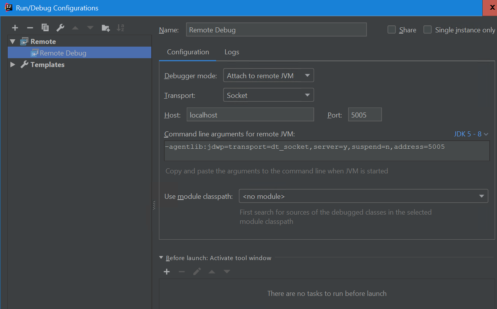

# Octopus Deploy Bamboo Plugin

## Documentation
https://octopus.com/docs/api-and-integration/bamboo/bamboo-plugin

## SDK Installation
This plugin used the Atlassian SDK. You can find more information about how to install and run the SDK from
https://developer.atlassian.com/display/DOCS/Introduction+to+the+Atlassian+Plugin+SDK

## Updating Bamboo Dependencies
Edit the `pom.xml` file and set `<bamboo.version>6.2.1</bamboo.version>` and `<bamboo.data.version>6.2.1</bamboo.data.version>`
(the actual versions will be different to these examples) to the latest Bamboo version. This in turn will mean `atlas-run`
will load the specified Bamboo version.

You can find the versions that are available at https://maven.atlassian.com/maven-external/com/atlassian/bamboo/atlassian-bamboo-web/.

## Running Bamboo
Run the command `atlas-run` to start an instance of Bamboo with the plugin deployed.

The credentials are `admin` / `admin`.

If Bamboo fails to start running `atlas-clean` may resolve the issue.

Note there is a bug in AMPS 8.0.0 that means `atlas-run` doesn't work.
See https://ecosystem.atlassian.net/browse/AMPS-1479 for details. The workaround
is to run
```
mvn com.atlassian.maven.plugins:amps-dispatcher-maven-plugin:8.0.0:run -gs C:/Applications/Atlassian/atlassian-plugin-sdk-8.0.4/apache-maven-3.5.4/conf/settings.xml
```

## Debugging Bamboo

Run the command `atlas-debug` to start an instance of Bamboo with the plugin deployed and debugging enabled.

Create a Remote Debug configuration as below.



Once the atlas command has the server to the point where it is fully running, you can start the Remote Debug configuration and IntelliJ will attach to the running process.

## Building the Plugin
Run the command `atlas-package` to build the plugin. The compiled plugin will be saved as `target\bamboo.jar`.

## Updating the Atlassian Marketplace

Keep in mind that the Bamboo plugin does not ship with the Octopus CLI tool. Updates to the CLI tool don't
require that the Bamboo plugin be republished.

To update the marketplace, use the following steps.

1. Build the JAR file. You can do this locally, or get the JAR file artifact from TeamCity. Note that you will need
   to increment the version inside the pom.xml file before building (`<version>1.0.3</version>`). This version is used 
   by the store to show the latest artifact to end users.
2. Browse to https://marketplace.atlassian.com/manage/plugins/com.octopus.bamboo/versions. Use the atlassian@octopus.com
   account - credentials are in the password manager.
3. Click the `Create version` button.
4. Follow the wizard to upload the JAR file. The wizard will show you a lot of pages relating to how the add-on is
   to be displayed, but you can keep the exiting content. The only requirement are some release notes.